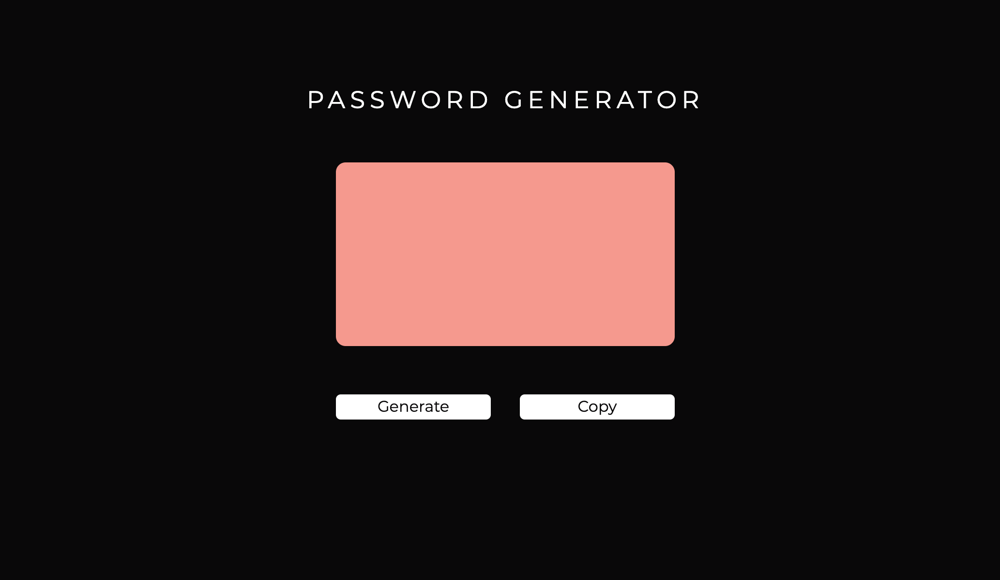

# Password Generator

This project is intended to produce a random password generator based on user-selected criteria. The application validates user input and ensures that at least one character type is selected. Once all prompts are answered, the user will be presented with a password matching the answered prompts. The user will have the option to copy the generated password to the clipboard by clicking the COPY button.

# Getting Started

1. Click the START button
2. The user is prompted to enter a character length between 8 and 128
3. The user is asked to confirm whether to include lowercase letters?
4. The user is asked to confirm whether to include uppercase letters?
5. The user is asked to confirm whether to include numbers?
6. The user is asked to confirm whether to special characters?

# Built With

Bootstrap - https://getbootstrap.com/

# Link

https://atb5498.github.io/homework5/

